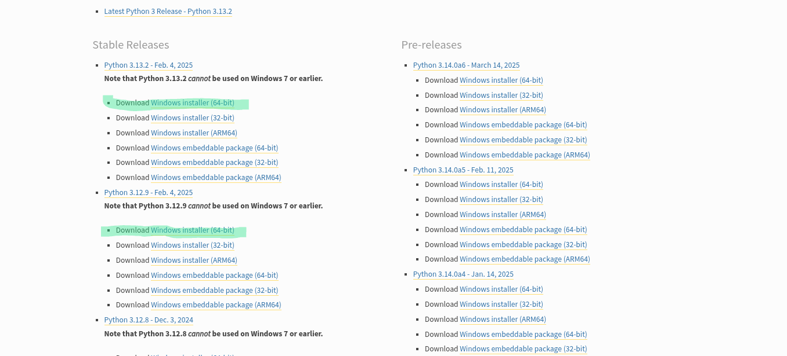

# Pythonのすゝめ

## 1. Pythonとは？
Pythonは構文が他のプログラミング言語と比べてシンプルで、比較的とっつきやすい言語で、データサイエンス分野やAI分野といった科学技術系の分野を中心に様々なところで使われています。今回はAIを作るわけではありませんが、そのために必要な技術の基盤となる基礎知識を身につけていきます。興味が湧いたら「Python　AI」と調べたら役に立つサイトがたくさん出てきます。なにか質問があればこれの作者まで。

**注意:これはPython未履修者、初学者向けなので簡単な説明しか載せていません。そのため、おかしな箇所や例外等があるかもしれませんがご了承ください。**

## 2. インストール
### 2-1.Pythonのインストール

1.[Pythonの公式サイト](https://www.python.org/downloads/windows/)にアクセスします。

2.パソコンの「設定」を開き、「システム」に移動して、「システムの種類」が64ビットか32ビットかを確認してください。

3.64ビットの場合は次のページの緑色のところのどちらかをクリックしてダウンロードします。(必要に応じて他のバージョンのものをダウンロードしても構いません。)

32ビットの場合はその一つ下のものをダウンロードします。



4.ダウンロードしたインストーラを起動し、下のAdd Python x.xx to PATHにチェックしてInstall Nowをクリックします。

5.待てばダウンロードされます。デバイス変更の許可を問われたら許可してください。


### 2-2.Visual Studio Codeのインストール(任意)

1.公式サイト(https://code.visualstudio.com/download)にアクセスしてwindows用のインストーラをダウンロードします。

2.ダウンロードしたインストーラを起動します。

3.利用規約に同意して「次へ」を押します。「デスクトップ上にアイコンを作成する」ボタンがあればそれにチェックして「次へ」、なければそのまま「次へ」を押します。

4.最後に「インストール」を押すとインストールされます。

5.言語を日本語にします。デスクトップ上にあるVisual Studio Codeを起動し、左側の虫眼鏡マークの3つ下のボタン(四角が4つあるボタン)をクリックしてExtensions Marketplaceの検索欄にjapaneseと入力し、「Japanse Language Pack for Visual Studio Code」をインストールします。

6.完了したら右下の「Change Language and Restart」ボタンをクリックするかアプリを再起動すると言語が日本語になります。

## 3.Pythonの基本知識
ダウンロードお疲れさまでした。さっそく本題に入りましょう。

### 3-1.数値、文字列
Pythonでは、文字列を扱う際には **""** ( **ダブルクォーテーション** ) または **''** ( **クォーテーション** ) でその文字列をくくらなければなりません。しかし、数値を扱う場合は何もつけないで使うことができます。数値も""か''でくくることで文字列として認識させることができます。

### 3-2. 変数、関数

変数とは、数値や文字列などの要素を格納できるものです。数学でやったことある人はあれをイメージしてください。変数を新しく作ることを変数を**定義する**といい、もともとある変数になにかを入れることを**代入する**といいます。以下は変数xに数値の3、appleにりんごという文字列を代入する例です。
```python
x=3
apple='りんご'
```

次は関数です。関数とは、入力(**引数**といいます。)に対し、ある処理を実行して特定の値(数値や文字列、True/Falseなど、**出力**といいます。)を返す(返さないこともあります。)ものです。一般に、関数を実行する際は次のように記述します。

```python
関数名(引数1, 引数2, 引数3, ......)
```

具体的な関数としてprint関数を見てみましょう。この関数は与えられた引数を標準出力と呼ばれる場所に表示する関数です。標準出力は実行結果などが表示される場所、程度の認識で大丈夫です。基本的な構文は

```python
print(出力するもの)
```
です。例えば、「こんにちは」と出力する場合には
```python
print('こんにちは')
```
と書き、
```
こんにちは
```
と出力されます。
関数を作ることもできるのですがそれはまたあとで。

## 3-3. 四則演算(+,-,×,÷)+α

pythonでは、+,-,×,÷等の基本的な計算を演算子を用いて行うことができます。二つの数値a,bに対し、
```python
a+b #足し算
a-b #引き算
a*b #掛け算
a/b #割り算
a%b #a÷bのあまり
a//b #a÷bの切り捨て
a**b #aのb乗

```
です。計算の順序は
カッコ内の計算 > 掛け算,割り算,あまり,aのb乗 > 足し算,引き算
です。たとえば、(12345 + 6789)×247を31で割った余りを出力するプログラムは
```python
print((12345+6789)*247 % 31)
```
で行うことができ、
```python
24
```
と出力されます。練習として電卓を作ってみてもいいかもしれませんね。

## 3-4 if文

if文は与えられた条件式が正しい(真,True)時と正しくない(偽,False)ときに処理を分けるものです。
基本的な構文は次の通りです。

```python
if 条件式1:
  条件式1が真のときの処理
elif 条件式2:
  条件式1が偽で条件式2が真のときの処理
else:
  条件式1も2も偽のとき
```

>[!TIP]
>Pythonでは空白(**インデント**)の数も重要です。:のあとの行の最初に空白があるのに気づきましたか？これの数が違うとエラーになってしまいます。
>この空白はスペースとは少し違い、Tabキーで入力できます。

>[!TIP]
>二つの数a,bを比べるときは==,<,>,<=,>=を用いることで比較できます。
>これらの記号は特定の条件が満たされたときにTrue、そうでなければFalseを返します。
>このTrue,Falseはbool型と呼ばれ、数値でも文字列でもない特別なものです。
>if文は条件式がTrueを返すかFalseを返すかで条件式の真偽を判定しています。

・a == bは二つの数a,bが等しいときにTrue、そうでないときにFalseを返します。

・a < bはaがbがより小さいときにTrue、そうでないときにFalseを返します。

・a > bはaがbより大きいときにTrue、そうでないときにFalseを返します。

・a <= bはaがb以下のときにTrue、そうでないときにFalseを返します。

・a >= bはaがb以上のときにTrue、そうでないときにFalseを返します。

例えば、nが偶数の時にn is even!、1の時はn is one!、そうではないときはn is odd and not one!と出力するコードは

```python
if n % 2 == 0:
  print('n is even!')
elif n == 1:
  print('n is one!')
else:
  print('n is odd and not one!')
```

となります。

## 3-5. リスト

リストは複数個のデータを保存できるもので、変数のデータ数が複数個に対応したようなイメージです。リストは **[]** でくくり、複数個の要素を入れるときは **,** (**カンマ**)で区切ります。リストには数値型、文字列型、bool型など様々な要素(ほかにもあります)を入れることができます。以下は3つの要素 「3,"チョコレート", True」を含んだリストAを定義する例です。
```python
A = [3, "チョコレート", True]
```
ある要素数がnのリストBが存在するとき、リストの**(i+1)**番目(i=**0**, 1, 2, ......, n-1)の要素は **B[i]** とすると取得できます。たとえば、先ほどのリストAの1番目の要素を標準出力に出力するコードは
```python
print(A[0])
```
となり、出力は
```python
3
```
>[!Tip]pythonでは1から数えるのではなく0から数えることに注意してください。

また、要素の番号は非負整数(0以上の整数)ではなく、負の整数(-1,-2など0より小さい整数)にも対応しています。このばあい、B[-i] (i=1, 2, 3, ......)はBの要素の後ろから数えてi番目の物を取得できます。次のリストCを定義してこの後ろから3番目を取得して標準出力に出力するコードは

```python
C = [1,2,3,4,5,'Super Delicious Banana!', -10, 20]

print(C[-3])
```

で、出力は

```python
Super Delicious Banana!
```

となります。
